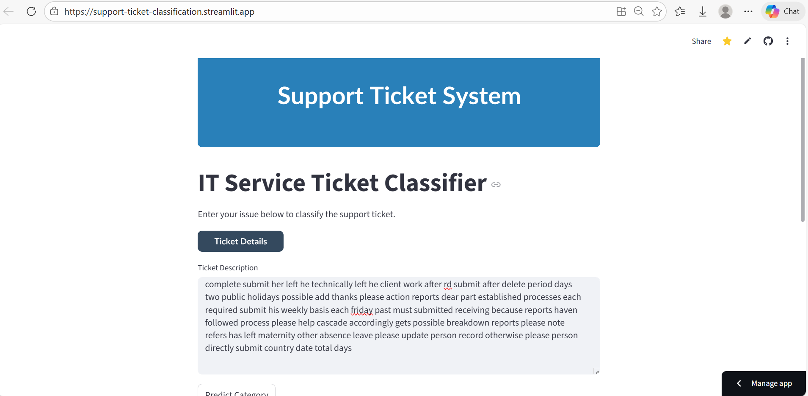
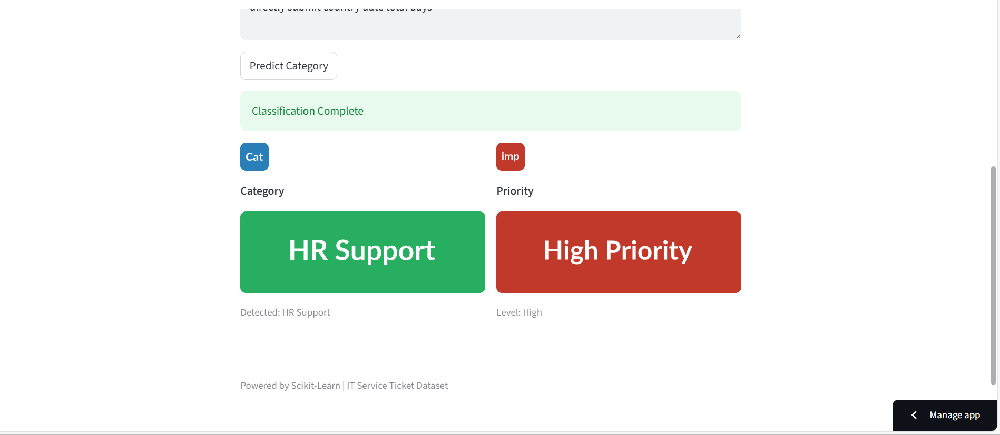

#  IT Service Ticket Classification System

##  Project Overview
This project is an **AI-powered Support Ticket Classification System** designed to automate the triage process for IT support teams. 
It uses **Machine Learning (Logistic Regression with TF-IDF)** to:
1.  **Classify Tickets**: Automatically categorizes tickets (e.g., Hardware, Access, Software).
2.  **Assign Priority**: Uses a **Smart Rule-Based Engine** (Keywords + Category context) to determine urgency (High/Medium/Low).

built with **Python**, **Scikit-Learn**, and **Streamlit**.

##  Features
- **Smart Priority Logic**: Automatically detects urgent keywords (e.g., "broken", "critical", "leaver") to assign High Priority.
- **Interactive UI**: A professional web interface built with **Streamlit**.
- **Data-Driven**: Trained on a dataset of 50,000+ support tickets.
- **Balanced Model**: Handles class imbalance to ensure fair prediction across all categories.

##  Project Structure
```
support-ticket-classification/
├── data/
│   ├── raw/                  # Original dataset
│   └── processed/            # Cleaned data for training
├── models/                   # Saved ML models (Pickle files)
├── notebooks/                # Jupyter Notebooks for EDA and Experiments
├── src/                      # Source Code
│   ├── predict.py            # Prediction Logic
│   ├── preprocessing.py      # Data Cleaning Pipeline
│   ├── streamlit_app.py      # Web Application (UI)
│   ├── train.py              # Model Training Script
│   └── utils.py              # Helper functions (Text cleaning, Priority Logic)
├── requirements.txt          # Dependencies
└── README.md                 # Project Documentation
```

## Setup & Installation

**1. Clone the repository / Open in VS Code**
- Open the folder `support-ticket-classification` in **VS Code**.
- Open a **New Terminal** (`Ctrl + ~` or `Terminal > New Terminal`).

**2. Create a Virtual Environment (Optional but Recommended)**
```bash
python -m venv venv
source venv/Scripts/activate  
```

**3. Install Dependencies**
```bash
pip install -r requirements.txt
```

**4. Train the Model** (If running for the first time)
```bash
python src/train.py
```

##  How to Run the App
To launch the User Interface, run:
```bash
streamlit run src/streamlit_app.py
```
The app will open in your browser automatically.

## Model Details
- **Algorithm**: Logistic Regression
- **Vectorization**: TF-IDF (10,000 features)
- **Accuracy**: ~84% (Weighted Average)
- **Priority Logic**: Hybrid (ML category + Keyword Heuristics)


### deployed link  
 https://share.google/0hBS9MxuUQOrElf9U

